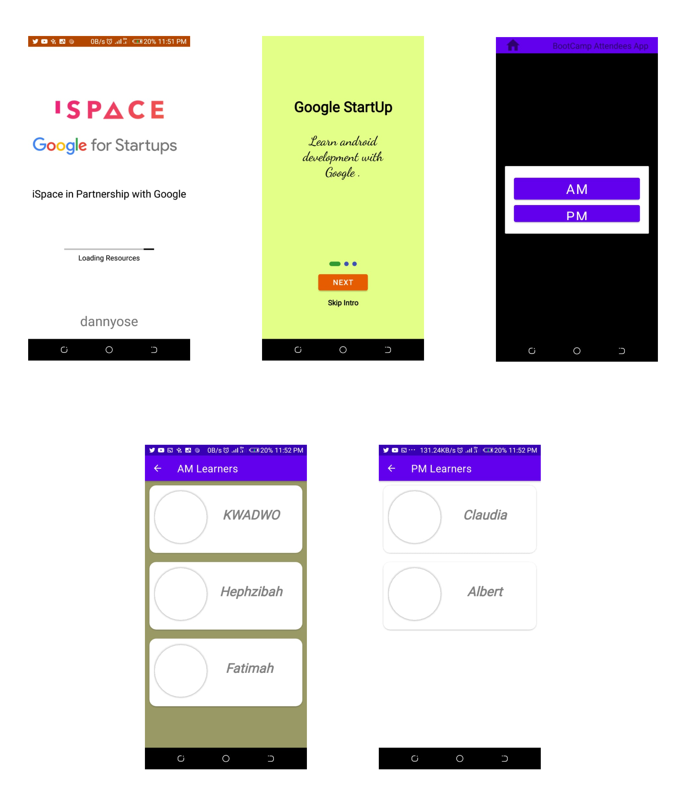

# iSpace Kotlin Bootcamp Project
Project Files From Kotlin Bootcamp 1 - @iSpace

## Achievements
+ Project displays a splash screen with iSpace and Google for startup logo on it
+ Project has list of student from the bootcamp
+ Project displays profile of each student

## Difficulty
+ Make project display profile image of each student

## Todos
+ Display profile image
+ Update project with suitable theme(color, fonts, etc)